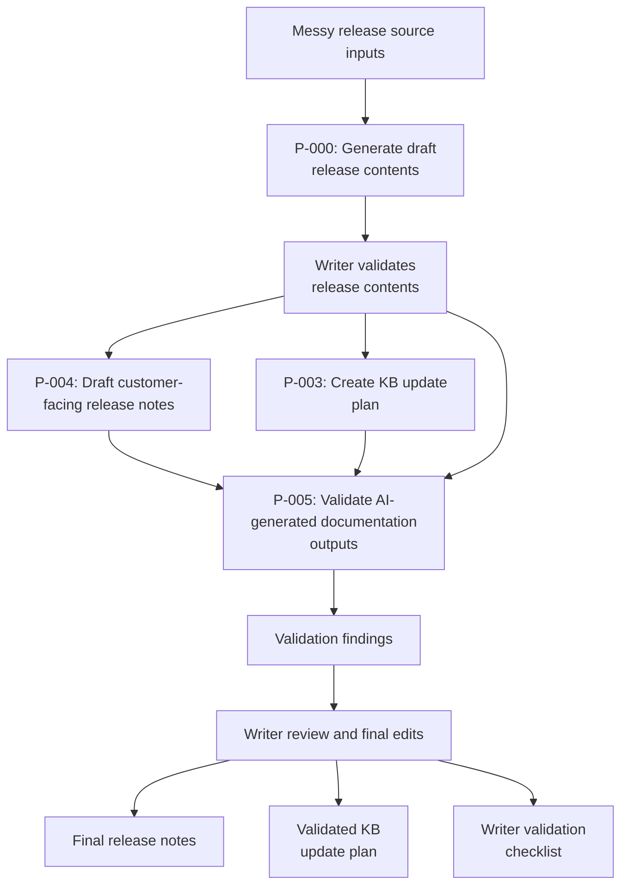
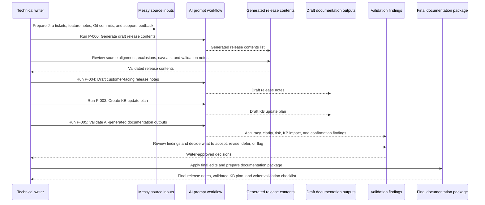

# AI-Assisted Release Documentation Triage Workflow

## Overview

This portfolio project demonstrates an AI-assisted workflow for turning semi-structured product release inputs into validated customer-facing release documentation.

The project uses a fictional SaaS product, **DeskPilot**, and a fictional release, **DeskPilot 2.4**, to simulate a realistic release documentation process.

The workflow focuses on release documentation triage: using AI to help identify customer-facing release items from messy source inputs, then applying technical writer judgement to validate, edit, and prepare final documentation outputs.

## Transparency note

This is a fictional, AI-assisted portfolio project. DeskPilot, the release inputs, and the release outputs are simulated for demonstration purposes.

* **AI** was used to help generate source materials, prompts, draft outputs, and case study wording. 
* **My role** was to define the project, guide the workflow, review and revise outputs, question the process, validate risks, and shape the final documentation package.

The project is intended to demonstrate AI-assisted documentation workflow design, not to present a real product release or measured workplace productivity result.

## Problem

Release documentation often depends on information scattered across multiple sources: Jira tickets, feature notes, Git commits, support feedback, and product discussions.

In many teams, the technical writer may not receive a clean list of customer-facing release changes. Instead, they need to work out what changed, what matters to users, which internal details should be excluded, which items need validation, and which help articles may need updating.

The hard part is not just writing release notes. The harder part is release triage: turning semi-structured and mixed product information into a structured, validated view of what should be communicated.

## Goal

The goal of this project was to design a practical AI-assisted workflow for release documentation.

The workflow needed to show how AI could help with high-volume analysis tasks, such as scanning source inputs, identifying customer-facing changes, excluding internal-only work, surfacing documentation impacts, and producing draft release documentation.

The workflow also needed to preserve the technical writer’s role in validation, editorial judgement, and final publishing decisions.

## Fictional product and release context

**DeskPilot** is a fictional SaaS customer support platform for small and mid-sized businesses. It helps support teams manage customer tickets, automate routine workflows, track service-level targets, and maintain a customer-facing knowledge base.

**Release:** DeskPilot 2.4  
**Release theme:** Faster support workflows, clearer automation controls, and improved ticket visibility.

The target users for the release are:

* Support agents
* Support team leads
* Workspace admins
* Customers who submit tickets or use the help centre

## Source inputs

The source pack included four types of release input:

* Jira tickets
* Feature notes
* Git commits
* Support feedback

These inputs were intentionally mixed. Some items described customer-facing changes, while others were implementation details, test updates, refactors, chores, or internal monitoring work that should not appear in customer-facing release documentation.

The AI-generated release contents were created from these source inputs. A prepared release contents list was not provided as an input.

## Workflow

The workflow was designed as a controlled AI-assisted process, not an automated publishing system.

AI helped process and organise the source material. The technical writer reviewed the output, checked source alignment, resolved uncertainty conservatively, and made the final publishing decisions.

### Workflow stages

| Stage                           | Purpose                                                                                                                              | Output                                                                     |
| ------------------------------- | ------------------------------------------------------------------------------------------------------------------------------------ | -------------------------------------------------------------------------- |
| Prepare messy source inputs     | Gather Jira tickets, feature notes, Git commits, and support feedback for the release.                                               | Source input files                                                         |
| Generate draft release contents | Use AI to identify customer-facing release items, classify change types, exclude internal-only work, and flag documentation impacts. | Generated release contents                                                 |
| Validate release contents       | Review the generated list for source alignment, missing items, unsupported claims, caveats, and product confirmation needs.          | Release contents validation notes                                          |
| Draft release notes             | Use the generated release contents to create a first-pass customer-facing release note draft.                                        | Draft release notes                                                        |
| Create KB update plan           | Convert documentation impact notes into a structured plan for help article updates, deferrals, and validation needs.                 | Draft KB update plan                                                       |
| Validate AI-generated outputs   | Check generated release contents, draft release notes, and KB plan against the source material and validation notes.                 | Validation findings                                                        |
| Final writer review             | Apply editorial judgement and create the final documentation package.                                                                | Final release notes, validated KB update plan, writer validation checklist |

### Human/AI sequence

## Writer validation

AI-generated content was treated as draft material only. The validation stage checked whether the generated release contents, draft release notes, and KB update plan were accurate and customer-facing.

The review focused on:

* Whether each release item was supported by the source inputs
* Whether internal-only technical changes had been excluded
* Whether customer impact was explained clearly
* Whether known issues were kept separate from fixes
* Whether wording avoided unsupported claims or overpromising
* Whether permission-related wording could mislead users
* Whether related knowledge base updates had been identified
* Whether any details required product owner or SME confirmation in a real release environment

Because DeskPilot is fictional, product-confirmation issues were handled conservatively. Where the source material did not confirm a detail, I either removed the claim, reworded it more cautiously, or recorded it as a validation note.

## Estimated time impact

The estimates below are indicative only. They are based on the relative effort involved in manually reviewing a variety of release inputs compared with using structured AI prompts and writer validation.

For this small simulated release, the AI-assisted workflow could reduce preparation effort by accelerating:

* release discovery
* triage against defined criteria
* first-draft creation

The largest time savings would likely come from using AI to:

* scan source inputs
* identify customer-facing release items
* exclude internal-only work
* surface documentation impacts
* produce a structured release contents list

However, the workflow depends on the source inputs containing enough useful information to support this analysis. **If the tickets, notes, commits, or support feedback were incomplete, contradictory, or too vague, the writer would need to spend more time investigating and confirming details.**

The key point is that this workflow does not remove the need for writer review. Validation, editorial judgement, source alignment, product confirmation, and final publishing decisions remain human responsibilities.

### Indicative effort comparison

| Activity | With AI-assisted workflow | Without AI workflow |
|---|---:|---:|
| Review source inputs | 30–45 mins | 1–1.5 hrs |
| Create release contents list | 30–45 mins | 1.5–3 hrs |
| Validate release contents list | 45 mins–1 hr | 45 mins–1 hr |
| Draft release notes | 30–45 mins | 1–1.5 hrs |
| Create KB update plan | 30–45 mins | 1–1.5 hrs |
| Validate draft outputs against sources | 1–1.5 hrs | 1–1.5 hrs |
| Edit final release notes and KB plan | 45 mins–1 hr | 1–1.5 hrs |
| Prepare final docs/package | 30–45 mins | 30–45 mins |
| **Indicative total** | **4–6 hrs** | **7–10 hrs** |

These estimates are intended to show where the workflow may reduce effort, not to claim a measured productivity result.

## Final outputs

The final documentation package included:

| Output                                                                                | Purpose                                                                                                                   |
| ------------------------------------------------------------------------------------- | ------------------------------------------------------------------------------------------------------------------------- |
| [Generated release contents](../02-ai-processing/generated-release-contents.md)       | AI-generated release contents list created from messy source inputs.                                                      |
| [Final release notes](../04-final-outputs/final-release-notes.md)                     | Customer-facing release notes for DeskPilot 2.4, edited after AI drafting and validation.                                 |
| [Validated KB update plan](../04-final-outputs/validated-kb-update-plan.md)           | A writer-reviewed plan showing which help articles should be updated, deferred, or handled with caution.                  |
| [Writer validation checklist](../03-writer-validation/writer-validation-checklist.md) | A reusable checklist for reviewing AI-assisted release documentation before publication.                                  |
| Source input files | Fictional [Jira tickets](../01-source-inputs/jira-tickets.csv), [feature notes](../01-source-inputs/feature-notes.csv), [Git commits](../01-source-inputs/git-commits.csv), and [support feedback](../01-source-inputs/support-feedback.csv) used to simulate a realistic release process. |
| [Prompt set](../prompts/)                                                             | Structured prompts used to generate release contents, draft release notes, create a KB update plan, and validate outputs. |

Together, these outputs show the full path from semi-structured source inputs to final writer-reviewed documentation.

## What I learned

This project reinforced that AI is most valuable in release documentation when it supports structured thinking rather than replacing judgement.

### Source quality

The source inputs in this prototype were intentionally mixed, but still more structured than some real workplace release inputs. In practice, **Jira tickets may be incomplete, contradictory, outdated, or linked to other tickets with conflicting information**.

Some prototype inputs also include writer-facing notes and documentation signals. In many teams, **this information is not provided clearly, and the writer has to capture it manually** through review, testing, meetings, or follow-up questions.

For this project, I included those notes to model a more documentation-aware release process: one where product, engineering, support, and documentation teams provide enough context for customer-facing communication.

### Project management

During the prototype, I initially used a single Excel workbook to manage planning, source inputs, prompts, outputs, and validation notes. As the project expanded, the workbook became harder to navigate.

In a future version, I would keep the workbook as a lightweight project tracker only, and manage source inputs, prompts, AI outputs, and final documentation as separate files in the repository from the start.

### Strongest use case: Release discovery and triage

The strongest use case was not simply **drafting release notes**. It was **release discovery and triage**: identifying customer-facing changes from scattered release inputs, excluding internal-only work, grouping related updates, and surfacing documentation impacts.

The generated release contents table also became the central source for the rest of the workflow. Because it already identified the main release items, change types, customer impacts, documentation impacts, and validation notes, I could use it directly to draft release notes and plan KB updates rather than adding extra intermediate analysis steps to extract and group data from the same information again.

This is where AI was most useful, because it helped **turn scattered source material into a structured release view that a writer could review and refine**.

### AI limits

The project also showed the limits of AI. The generated outputs still needed human review to check source alignment, remove unsupported claims, clarify permission wording, keep known issues separate from fixes, and flag details that would require product confirmation.

AI could accelerate the analysis and drafting work, but it could not confirm product behaviour or make final publishing decisions.

### Hybrid workflow

A useful AI-assisted workflow does not need to be fully automated to be valuable.

A controlled manual workflow, using structured prompts and clear validation steps, can still improve documentation speed while preserving editorial control.

## Future improvements

In a real documentation environment, I would extend the workflow by providing previous release note examples, an approved documentation style guide, product terminology, and existing KB article samples.

These inputs would help the AI follow the company’s preferred structure, tone, terminology, and level of detail more closely.

I would also test the workflow with larger and messier release inputs to understand where the process scales well and where additional human review, source tagging, or prompt refinement would be needed.

## What this demonstrates

This project demonstrates my ability to:

* Design a practical AI-assisted documentation workflow
* Use AI to support release discovery and triage
* Translate messy product inputs into clear customer-facing release documentation
* Maintain a high velocity of documentation updates without bypassing review
* Separate customer-facing changes from internal technical detail
* Identify related knowledge base impacts from release changes
* Validate AI-generated content against source material
* Apply editorial judgement to reduce ambiguity, overclaiming, and publishing risk
* Preserve human ownership of final documentation decisions

The project is intentionally scoped as a workflow prototype rather than a full automation tool. This keeps the focus on documentation judgement, process design, and responsible AI use.
