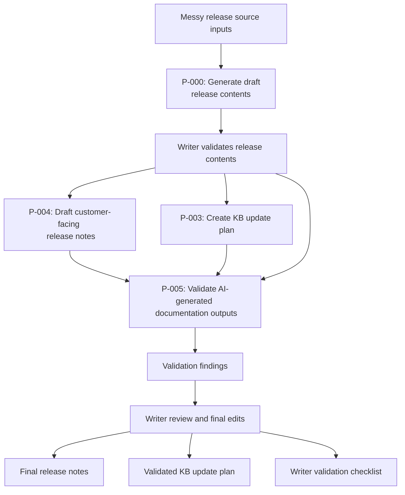

# AI-Assisted Release Documentation Triage Workflow

This portfolio project demonstrates an AI-assisted workflow for turning messy product release inputs into validated customer-facing release documentation.

The project uses a fictional SaaS product, **DeskPilot**, and a fictional release, **DeskPilot 2.4**, to simulate a realistic release documentation process.

## Project goal

Build a practical workflow that shows how AI can support release discovery, documentation triage, release note drafting, KB impact analysis, and writer-led validation.

The focus is not on fully automating release documentation. The focus is on using AI to accelerate high-volume analysis and drafting tasks while keeping the technical writer responsible for accuracy, judgement, and final publishing decisions.

## Fictional product context

**DeskPilot** is a fictional SaaS customer support platform for small and mid-sized businesses. It helps support teams manage customer tickets, automate routine workflows, track service-level targets, and maintain a customer-facing knowledge base.

**Release:** DeskPilot 2.4
**Release theme:** Faster support workflows, clearer automation controls, and improved ticket visibility.

## Workflow overview

The workflow uses structured prompts to process messy release source material through a controlled documentation pipeline.



## Source inputs

The fictional source pack includes:

* Jira tickets
* Feature notes
* Git commits
* Support feedback

These inputs are intentionally mixed. Some items describe customer-facing changes, while others are internal technical details, tests, refactors, chores, or implementation notes that should not appear in customer-facing release documentation.

## AI-assisted workflow outputs

The AI-assisted processing stage produces:

* Generated release contents
* Draft release notes
* Draft KB update plan
* Validation findings

## Final writer-reviewed outputs

The final outputs include:

* Final release notes
* Validated KB update plan
* Writer validation checklist

## Human review layer

AI output is treated as draft material only.

The writer reviews the outputs for:

* Source alignment
* Customer relevance
* Internal-only exclusions
* Unsupported claims
* Known issue handling
* Permission wording
* Documentation impact
* Product confirmation needs
* Final publishing readiness

## Repository structure

```text
ai-assisted-release-documentation-workflow/
  README.md
  01-source-inputs/
  02-ai-processing/
  03-writer-validation/
  04-final-outputs/
  05-case-study/
  prompts/
  archive-baseline/
```

## Key files

| File                                                                               | Description                                                         |
| ---------------------------------------------------------------------------------- | ------------------------------------------------------------------- |
| [Case study](05-case-study/case-study.md)                                          | Explains the project, workflow, validation process, and outcomes.   |
| [Generated release contents](02-ai-processing/generated-release-contents.md)       | AI-generated release contents created from messy source inputs.     |
| [Final release notes](04-final-outputs/final-release-notes.md)                     | Writer-reviewed customer-facing release notes for DeskPilot 2.4.    |
| [Validated KB update plan](04-final-outputs/validated-kb-update-plan.md)           | Writer-reviewed plan for related knowledge base updates.            |
| [Writer validation checklist](03-writer-validation/writer-validation-checklist.md) | Checklist used to review AI-assisted release documentation outputs. |
| [Prompt set](prompts/)                                                             | Reusable prompts used in the revised workflow.                      |

## What this demonstrates

This project demonstrates the ability to:

* Use AI to support release discovery and triage
* Maintain a high velocity of documentation updates
* Translate messy product inputs into customer-facing release documentation
* Separate customer-facing changes from internal technical detail
* Identify knowledge base impacts from release changes
* Validate AI-generated content before publication
* Preserve technical writer judgement in an AI-assisted process
